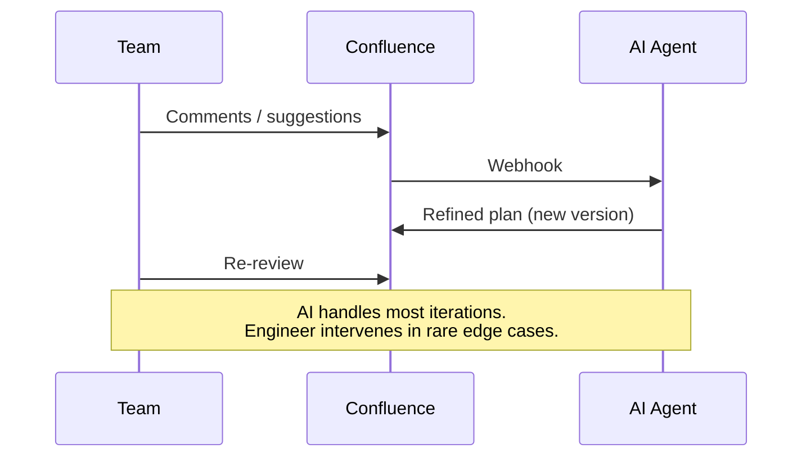

> This page is a technical annex to my résumé. It is aimed at a technical specialist who wants to see concrete architecture decisions rather than a list of technologies on a CV.

## Context

A single feature can touch dozens of services. PR descriptions don't capture the cross-service picture. This workflow keeps plans on a collaborative page (e.g. Confluence) as the single source of truth — reviewed before implementation, kept in sync after.

---

## The Pipeline

1. **Plan** — AI agent(alone or with an engineer) draft the design on a collaborative page (e.g. Confluence)
2. **Review** — team reviews, AI refines based on comments
3. **Implement** — AI agents (and an engineer) execute the work. Agents hallucinate far less when working from a human-approved, verified plan with explicit boundaries.
4. **Sync**  — on every merge, AI agent ensures a plan exists and matches code

---

### Review

The plan is published as a versioned page — essentially a **Pull Request for architecture**: versioning, inline comments, approve/decline, suggestions.

---

### Plan–Code Sync (on merge)

If no plan exists yet (hotfix, urgent patch), the agent generates one from the diff so the knowledge base stays complete.

---

## Long-Term Value — Plans as Knowledge Base

Over time, the plan space becomes a structured knowledge base — used as a **RAG** source for AI agents, and as a regular wiki for engineers.

- AI agent receives a new user story → searches for similar past plans → drafts a new plan pre-filled with proven patterns
- Similar tasks that previously required days of design reduce to reviewing an AI-generated draft
- Plans serve as training data — fine-tuning or few-shot examples that teach models how the team maps user stories to implementation