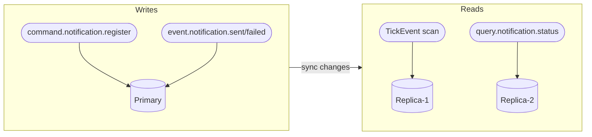
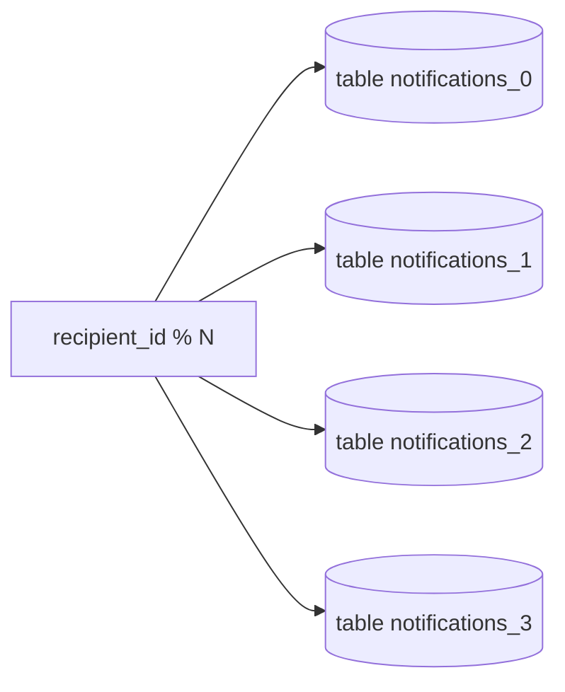
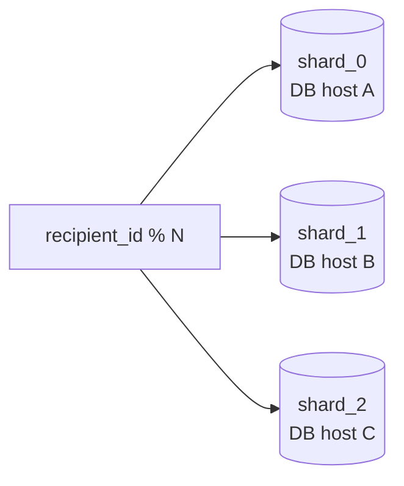
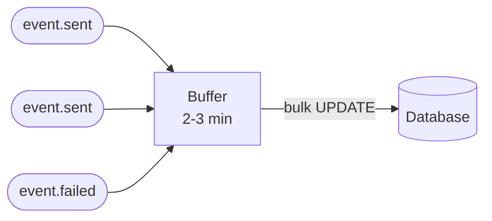

> This page is a technical annex to my résumé. It is aimed at a technical specialist who wants to see concrete architecture decisions rather than a list of technologies on a CV.

## Context

Continuing the [microservices communication](/log/microservices-communication/) example. `Notifications.EventTicker` periodically emits scheduling ticks; `Notifications.State` scans the database for due tasks and dispatches them. At millions of scheduled notifications, the database becomes the bottleneck. Here's how I handle it.

---

## CQRS & Read Replicas

Commands (writes) go to the primary. Queries and ticker scans (reads) go to replicas. This separates write contention from read load.



> Read replicas introduce **eventual consistency**. A newly scheduled notification may not be visible to ticker scans until replication catches up, which is acceptable.

---

## Partitioning

The notifications table is split by `recipient_id` into fixed partitions:



Each partition is an independent table with its own indexes. 

---

## Sharding

Partitioning splits tables within one database. Sharding moves those partitions to separate database instances:



Each `Notifications.EventTicker` instance owns a shard and emits ticks scoped to it. `Notifications.State` for that shard connects only to its database host.

---

## Time-Shift(Jittering) — Flattening the Spike

Without time-shift, all notifications scheduled for "9:00 AM" hit the database at 09:00:00 sharp — a thundering herd.

On schedule creation, `Notifications.State` applies jitter:

```csharp
private static DateTimeOffset ApplyTimeShift(DateTimeOffset nominal, TimeSpan window)
{
    var jitter = TimeSpan.FromMilliseconds(
        Random.Shared.NextInt64(0, (long)window.TotalMilliseconds));
    return nominal.Add(jitter);
}
```

Result: the nominal 09:00 batch is distributed over the 09:00–09:05 window. The ticker processes small batches every second rather than a single large spike at 09:00.

---

## Batching — Reduce Round Trips

Instead of writing to the database on every `event.notification.sent/failed`, `Notifications.State` accumulates events in memory for 2–3 minutes, then flushes them as a single bulk update:



Result: hundreds of individual `UPDATE` statements collapse into one round trip. The trade-off is a short delay before the status is persisted.